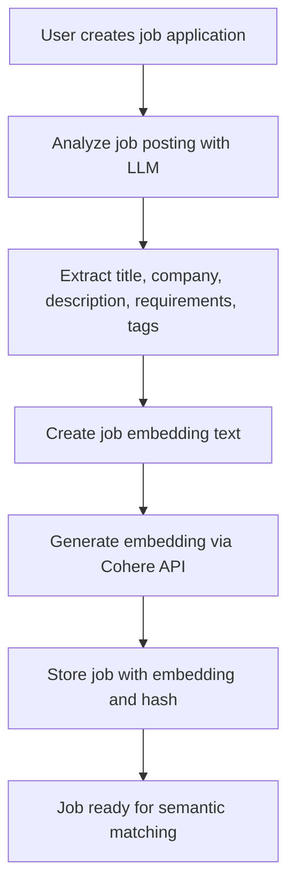
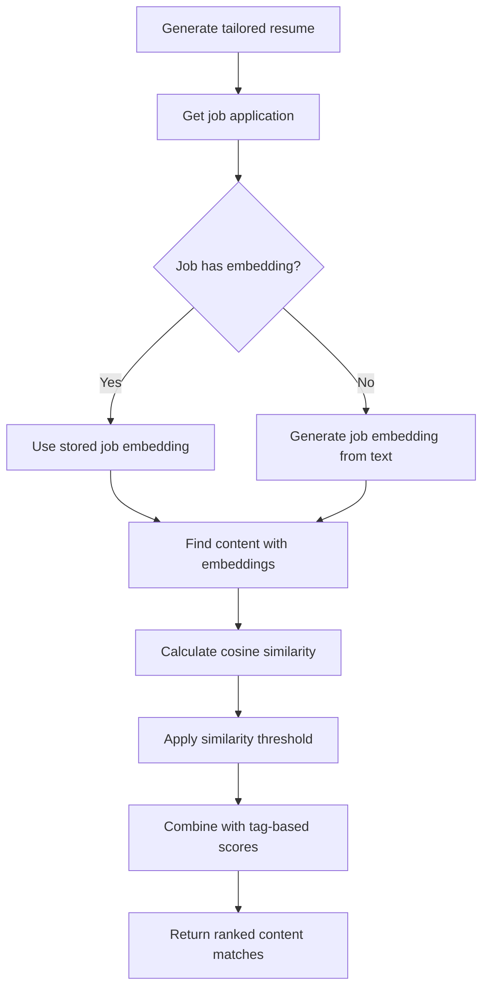

# RAG System Documentation - ReactiveResumeTracker

## Overview

The ReactiveResumeTracker application now includes a sophisticated RAG (Retrieval-Augmented Generation) system that uses vector embeddings and semantic search to intelligently match job applications with relevant content from the user's content library.

## Architecture

### Core Components

#### 1. EmbeddingService (`apps/server/src/embedding/embedding.service.ts`)
- **Purpose**: Handles all vector operations and Cohere API integration
- **Key Features**:
  - Generate embeddings using Cohere's `embed-english-v3.0` model
  - Batch embedding generation (up to 96 texts per request)
  - Cosine similarity calculations
  - Vector similarity search
  - Embedding serialization/deserialization
  - Hash generation for caching

#### 2. ContentMatchingService (`apps/server/src/content-matching/content-matching.service.ts`)
- **Purpose**: Handles hybrid content matching (vector similarity + tag matching)
- **Key Features**:
  - Vector similarity matching as primary method
  - Tag-based matching as secondary method
  - Weighted scoring system (default: 70% vector, 30% tags)
  - Configurable matching options
  - Comprehensive scoring and suggestions

#### 3. Enhanced JobApplicationService (`apps/server/src/job-application/job-application.service.ts`)
- **Purpose**: Manages job applications with automatic embedding generation
- **Key Features**:
  - Automatic embedding generation on job creation
  - Embedding caching and validation
  - Enhanced resume generation using vector similarity
  - Smart embedding updates when job data changes

#### 4. Enhanced ContentLibraryService (`apps/server/src/content-library/content-library.service.ts`)
- **Purpose**: Provides vector similarity search for content
- **Key Features**:
  - Vector similarity search method
  - Configurable similarity thresholds
  - Integration with existing tag-based search

## How It Works

### 1. Job Application Creation Flow



**Job Embedding Text Format:**
```
Job Title: [title]
Company: [company]
Description: [description]
Requirements: [requirement1]. [requirement2]. [requirement3]
Key Skills: [tag1], [tag2], [tag3]
```

### 2. Content Matching Flow



### 3. Hybrid Scoring System

The system uses a weighted combination of:

- **Vector Similarity (70% weight)**: Semantic similarity between job and content embeddings
- **Tag Matching (30% weight)**: Traditional keyword/tag overlap scoring

**Score Calculation:**
```typescript
finalScore = (vectorSimilarity * 0.7) + (tagScore * 0.3)
```

## Configuration

### Environment Variables

```bash
# Cohere API Configuration
COHERE_API_KEY=your_cohere_api_key_here
# Alternative key name
CO_API_KEY=your_cohere_api_key_here

# Model Configuration (optional)
COHERE_MODEL=embed-english-v3.0
```

### Matching Options

```typescript
interface MatchingOptions {
  useVectorSimilarity?: boolean;  // Default: true
  useTagMatching?: boolean;       // Default: true
  vectorWeight?: number;          // Default: 0.7
  tagWeight?: number;             // Default: 0.3
  minSimilarity?: number;         // Default: 0.0
  maxResults?: number;            // Default: 50
}
```

## Database Schema

### JobApplication Table
```sql
-- New fields added for RAG
embedding           TEXT    -- JSON array of embedding vector (1024 dimensions)
embeddingHash       TEXT    -- SHA256 hash of embedding input for caching
```

### Content Table
```sql
-- Existing fields for RAG (already populated)
data                TEXT    -- Structured JSON data
embedding           TEXT    -- JSON array of embedding vector (1024 dimensions)
embeddingHash       TEXT    -- SHA256 hash of embedding input for caching
transformationDate  DATETIME -- When content was transformed
transformationNotes TEXT    -- Transformation metadata
```

## API Endpoints

All existing API endpoints remain unchanged. The RAG system works transparently:

### Job Application Creation
- `POST /job-applications/create-from-analysis`
- `POST /job-applications/analyze` (followed by create-from-analysis)

**New Behavior**: Automatically generates embeddings for job applications

### Resume Generation
- `POST /job-applications/:id/generate-resume`

**Enhanced Behavior**: Uses vector similarity for better content matching

## Performance Considerations

### Embedding Generation
- **Cohere API Limits**: 96 texts per batch request
- **Rate Limiting**: 1 second delay between batches
- **Caching**: Embeddings are cached using SHA256 hashes
- **Fallback**: System continues to work if embedding generation fails

### Vector Search
- **In-Memory Calculation**: Currently uses in-memory cosine similarity
- **Optimization Opportunity**: Could be enhanced with vector databases (Pinecone, Weaviate, etc.)
- **Threshold Filtering**: Configurable minimum similarity thresholds

### Caching Strategy
- **Embedding Hashes**: SHA256 hashes prevent regenerating identical embeddings
- **Update Detection**: Embeddings regenerated only when job data changes
- **Graceful Degradation**: Falls back to tag-based matching if embeddings unavailable

## Error Handling

### Embedding Service Failures
```typescript
// Graceful degradation
try {
  const embedding = await embeddingService.generateEmbedding(text);
} catch (error) {
  logger.warn("Embedding generation failed, continuing without embeddings");
  // System continues with tag-based matching only
}
```

### API Key Issues
- System detects missing/invalid Cohere API keys
- Automatically disables vector similarity matching
- Falls back to tag-based matching
- Logs appropriate warnings

## Monitoring and Debugging

### Logging
- Embedding generation success/failure
- Vector similarity match counts
- Performance metrics (embedding generation time)
- Cache hit/miss ratios
- API key status

### Debug Information
```typescript
// Example log outputs
"Generated embedding for job: Software Engineer at TechCorp (hash: a1b2c3d4...)"
"Using stored job embedding for enhanced content matching"
"Vector similarity found 15 matches"
"Auto-selected 12 relevant content pieces using hybrid matching with job embedding"
```

## Testing

### Unit Tests
- EmbeddingService: Test embedding generation, similarity calculations
- ContentMatchingService: Test hybrid matching logic
- JobApplicationService: Test embedding integration

### Integration Tests
- End-to-end job creation with embedding generation
- Resume generation with vector similarity matching
- Fallback behavior when embeddings unavailable

### Manual Testing
1. Create job application → Verify embedding generated
2. Generate resume → Verify vector similarity used
3. Update job application → Verify embedding updated if needed
4. Test without Cohere API key → Verify graceful fallback

## Future Enhancements

### Vector Database Integration
- **Pinecone**: Cloud-based vector database
- **Weaviate**: Open-source vector database
- **Qdrant**: High-performance vector search engine

### Advanced Features
- **Semantic Content Clustering**: Group similar content automatically
- **Content Recommendations**: Suggest missing content based on job requirements
- **Multi-language Support**: Embeddings for non-English content
- **Fine-tuned Models**: Custom embeddings for resume/job domain

### Performance Optimizations
- **Async Embedding Generation**: Background processing for large batches
- **Embedding Precomputation**: Generate embeddings for common job patterns
- **Similarity Caching**: Cache similarity calculations for frequent comparisons

## Troubleshooting

### Common Issues

#### 1. No Vector Similarity Results
**Symptoms**: Only tag-based matching working
**Causes**: 
- Missing/invalid Cohere API key
- No content has embeddings
- Network issues with Cohere API

**Solutions**:
- Verify `COHERE_API_KEY` environment variable
- Check content library has transformed content with embeddings
- Check network connectivity and API limits

#### 2. Poor Matching Quality
**Symptoms**: Irrelevant content being matched
**Causes**:
- Low similarity thresholds
- Imbalanced vector/tag weights
- Poor quality job descriptions

**Solutions**:
- Increase `minSimilarity` threshold
- Adjust `vectorWeight` and `tagWeight` ratios
- Improve job description quality

#### 3. Slow Performance
**Symptoms**: Long response times for resume generation
**Causes**:
- Large content libraries
- Repeated embedding generation
- Network latency to Cohere API

**Solutions**:
- Implement embedding caching
- Use batch processing for content
- Consider vector database for large datasets

## API Reference

### EmbeddingService Methods

```typescript
// Generate single embedding
generateEmbedding(text: string): Promise<EmbeddingResult>

// Generate multiple embeddings
generateEmbeddingsBatch(texts: string[]): Promise<EmbeddingResult[]>

// Calculate similarity
calculateCosineSimilarity(embedding1: number[], embedding2: number[]): SimilarityResult

// Find most similar
findMostSimilar(queryEmbedding: number[], candidates: any[], topK: number): any[]

// Utility methods
generateHash(text: string): string
parseEmbedding(embeddingStr: string): number[]
serializeEmbedding(embedding: number[]): string
```

### ContentMatchingService Methods

```typescript
// Main matching method
matchContentToJob(
  userId: string,
  jobRequirements: string[],
  jobDescription: string,
  options?: MatchingOptions,
  jobEmbedding?: number[]
): Promise<ContentMatchResult[]>
```

## Conclusion

The RAG system provides intelligent, semantic-based content matching that significantly improves the quality of generated resumes. By combining vector similarity with traditional tag matching, the system offers both accuracy and reliability while maintaining backward compatibility with existing functionality.

The architecture is designed for scalability and can be easily extended with additional vector databases, embedding models, or matching algorithms as needed. 