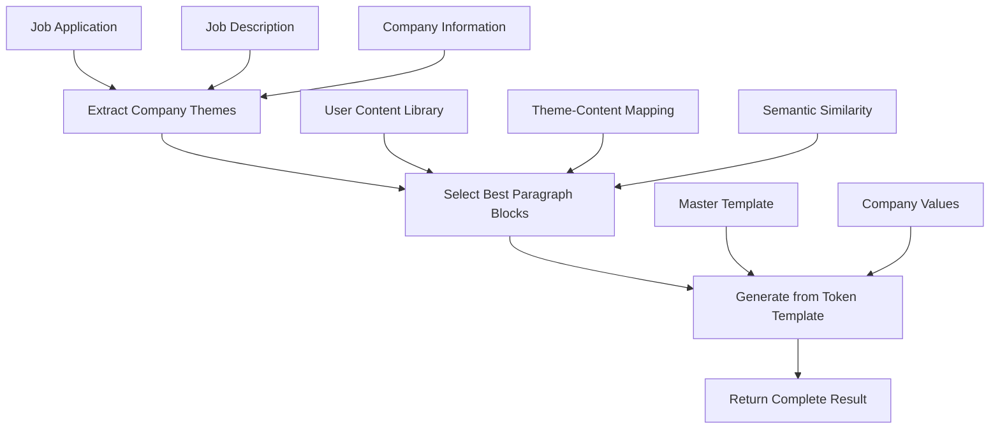

# Tailored Cover Letter Generation System

## 🎯 **Overview**

The Tailored Cover Letter Generation system implements a mass-production workflow that automatically creates personalized cover letters by analyzing job requirements, extracting company themes, and selecting the best matching content from the user's cover letter content library.

This system follows the approach outlined in the `cover_letter_content_library.md` document, using token-based templates and intelligent content selection to produce high-quality, targeted cover letters at scale.

---

## 🏗️ **Architecture**

### **Core Components**



### **Service Layer**

#### **JobApplicationService**
- `generateTailoredCoverLetter()` - Main orchestration method
- `calculateContentDiversity()` - Content diversity scoring

#### **LLMService** 
- `extractCompanyThemes()` - Analyzes job descriptions for key themes
- `selectBestCoverLetterParagraphs()` - Smart content selection
- `generateTailoredCoverLetterFromTemplate()` - Token-based generation
- `buildMasterCoverLetterTemplate()` - Template structure
- `calculateCompanyValueAlignment()` - Company value scoring

#### **CoverLetterContentService**
- `findByType()` - Content retrieval by paragraph type
- `selectBestStoriesForJob()` - Story selection for jobs

---

## 🔄 **Generation Workflow**

### **Step 1: Company Theme Analysis**

**Purpose**: Extract key themes from job description and company information.

**Process**:
1. Analyze job description text
2. Incorporate company values, mission, culture
3. Map to predefined themes using LLM analysis
4. Return 3-5 prioritized themes

**Available Themes**:
- `analytics`: Data analysis, quantitative skills, research
- `diversity`: Cultural adaptability, curiosity, global experience
- `leadership`: Team management, mentoring, driving results
- `tech`: Technical skills, software development, innovation
- `collaboration`: Teamwork, cross-functional work, communication
- `innovation`: Creative problem-solving, new ideas, process improvement
- `impact`: Results-oriented, measurable outcomes, business impact
- `growth`: Learning ability, career development, adaptability
- `challenge`: Overcoming obstacles, resilience, difficult situations
- `values`: Company culture fit, ethical behavior, mission alignment

**API**: `LLMService.extractCompanyThemes(jobDescription, companyInfo)`

### **Step 2: Content Selection**

**Purpose**: Select the best matching paragraph blocks from the user's content library.

**Process**:
1. **Theme Mapping**: Map company themes to content types
   ```typescript
   const themeToContentTypeMap = {
     analytics: ["PARAGRAPH_ANALYTICS", "PARAGRAPH_IMPACT"],
     diversity: ["PARAGRAPH_DIVERSITY", "PARAGRAPH_GROWTH"],
     leadership: ["PARAGRAPH_LEADERSHIP", "PARAGRAPH_COLLABORATION"],
     tech: ["PARAGRAPH_TECH", "PARAGRAPH_INNOVATION"],
     // ... etc
   };
   ```

2. **Semantic Scoring**: Use embeddings to calculate relevance
   - Generate embedding for search query (theme + job description + company values)
   - Calculate cosine similarity with content embeddings
   - Score and rank candidate content

3. **Company Value Alignment**: Calculate alignment with company values
   - Keyword overlap between content and company values
   - Return normalized score (0-1)

4. **Diversity Enforcement**: Ensure variety in content types
   - Prefer different content types for each paragraph slot
   - Fill remaining slots with diverse content if needed

**API**: `LLMService.selectBestCoverLetterParagraphs(userId, themes, jobDescription, companyInfo, options)`

### **Step 3: Token-Based Generation**

**Purpose**: Generate the final cover letter using a token-based template system.

**Master Template Structure**:
```text
[FIRST NAME] [LAST NAME]
[Address] (optional)
E: [Email] | M: [Phone]
[LinkedIn] (optional)

[Date]

[Recruiter Name] (optional)
[Company Name]
[Company Address] (optional)

Application for [Role] at [Company]

Dear [Name | Recruiting Team | Hiring Manager],

[Intake-Sentence]

[Paragraph A]

[Paragraph B]

[Paragraph C]

[Closing-Sentence]

Sincerely,

[Your Name]
```

**Token Replacement**:
- **Personal Data**: `[FIRST NAME]`, `[LAST NAME]`, `[Email]` from user profile
- **Company Data**: `[Company Name]`, `[Role]` from job application
- **Dynamic Content**: `[Paragraph A/B/C]` from selected content blocks
- **Generated Content**: `[Intake-Sentence]`, `[Closing-Sentence]` generated by LLM

**Lexical Tuning**:
- Echo company language from values/mission/culture
- Use industry-specific terminology
- Mirror company communication style
- Inject company-specific facts naturally

**API**: `LLMService.generateTailoredCoverLetterFromTemplate(user, jobApplication, companyInfo, selectedContent, themes, options)`

---

## 📡 **API Reference**

### **Generate Tailored Cover Letter**

**Endpoint**: `POST /api/job-applications/:id/generate-tailored-cover-letter`

**Request Body**:
```typescript
{
  templateName?: string;     // Default: "professional"
  tone?: string;            // Default: "professional"
  maxParagraphs?: number;   // Default: 3
}
```

**Response**:
```typescript
{
  coverLetter: string;           // Generated cover letter text
  usedContent: Array<{           // Content used in generation
    id: string;
    contentType: string;
    skillTheme: string;
    paragraphType: string;
    matchScore: number;
    companyValueAlignment: number;
  }>;
  companyThemes: string[];       // Extracted company themes
  selectedParagraphs: Array<any>; // Full paragraph block data
  template: string;              // Template name used
  tone: string;                  // Tone used
  metadata: {
    companyValueAlignment: number;  // 0-100 score
    contentDiversity: number;       // 0-100 score
    overallFitScore: number;        // 0-100 score
  };
}
```

**Error Responses**:
- `400`: Job application not found
- `422`: No relevant cover letter content found
- `500`: Generation failed

---

## 🎨 **Frontend Integration**

### **Cover Letter Builder Toolbar**

**Location**: `apps/client/src/pages/cover-letter-builder/_components/toolbar.tsx`

**Button**: "Generate Cover Letter" (SparkleIcon / MagicWandIcon)

**Success Flow**:
1. Call API endpoint
2. Parse response data
3. Show success toast with details:
   ```typescript
   toast({
     title: "Cover Letter Generated Successfully",
     description: `Used ${usedContentCount} stories addressing ${themes} (${fitScore}% fit)`
   });
   ```
4. Log results to console for debugging
5. TODO: Send content to artboard iframe

**Error Flow**:
1. Parse error response
2. Show specific error message:
   - Missing content library: "Please add cover letter stories to your content library first"
   - Other errors: Display actual error message
3. Log error details to console

### **State Management**

**Store**: `useCoverLetterBuilderStore`

**Relevant State**:
```typescript
{
  generation: {
    isGenerating: boolean;
    currentStep?: string;
    progress?: number;
  };
  template: {
    selectedTemplate: string;
    tone: string;
  };
}
```

---

## 📊 **Content Library Requirements**

### **Database Schema**

**CoverLetterContent Model**:
```sql
model CoverLetterContent {
  id          String                @id @default(cuid())
  contentType CoverLetterContentType  -- PARAGRAPH_ANALYTICS, etc.
  contentId   String                -- References Content.id
  storyText   String                -- 3-5 sentence story format
  skillTheme  String                -- leadership, analytical thinking, etc.
  tone        String                @default("professional")
  tags        String                @default("[]")
  embedding   String?               -- Vector embedding for semantic matching
  embeddingHash String?             -- Cache hash for embedding
  userId      String
  createdAt   DateTime              @default(now())
  updatedAt   DateTime              @updatedAt
}
```

**Content Types**:
- `PARAGRAPH_ANALYTICS`: Quantitative + qualitative analytical skills
- `PARAGRAPH_DIVERSITY`: Diversity & curiosity stories
- `PARAGRAPH_LEADERSHIP`: Leadership + client management
- `PARAGRAPH_TECH`: Technical depth (software/AI)
- `PARAGRAPH_CHALLENGE`: Problem-solving and resilience
- `PARAGRAPH_COLLABORATION`: Teamwork and communication
- `PARAGRAPH_INNOVATION`: Creative problem-solving
- `PARAGRAPH_IMPACT`: Results-oriented achievements
- `PARAGRAPH_GROWTH`: Learning ability and adaptability
- `PARAGRAPH_VALUES`: Company culture and values alignment

### **Content Creation**

**Required for Generation**:
1. **Minimum Content**: At least 2-3 cover letter stories in content library
2. **Content Diversity**: Different content types for better selection
3. **Quality Stories**: 3-5 sentence format with specific achievements
4. **Skill Themes**: Clear theme classification (leadership, analytics, etc.)

**Best Practices**:
- Create 5-10 story blocks covering different themes
- Include quantifiable achievements where possible
- Write in professional tone unless specified otherwise
- Tag stories with relevant keywords
- Update stories regularly based on recent experiences

---

## 🧪 **Testing & Validation**

### **Unit Tests**

**Service Methods**:
- `extractCompanyThemes()`: Test theme extraction accuracy
- `selectBestCoverLetterParagraphs()`: Test content selection logic
- `generateTailoredCoverLetterFromTemplate()`: Test template generation
- `calculateCompanyValueAlignment()`: Test scoring accuracy

### **Integration Tests**

**API Endpoints**:
- Test full generation workflow
- Test error handling for missing content
- Test response format and data structure
- Test performance with large content libraries

### **User Acceptance Tests**

**Generation Quality**:
- Cover letter reads naturally and professionally
- Selected content is relevant to job requirements
- Company themes are accurately identified
- Template tokens are properly replaced
- Lexical tuning reflects company language

**User Experience**:
- Generation completes within reasonable time (< 30 seconds)
- Error messages are helpful and actionable
- Success feedback provides useful information
- Generated content can be edited and refined

---

## 📈 **Performance Considerations**

### **Optimization Strategies**

**Embedding Caching**:
- Cache job description embeddings
- Cache company theme analysis results
- Use embedding hashes for deduplication

**Content Selection**:
- Limit content library scanning for large libraries
- Use indexed database queries where possible
- Implement pagination for content selection

**LLM Optimization**:
- Use efficient prompts to reduce token usage
- Cache frequently used template structures
- Implement request batching where applicable

### **Scalability**

**Database**:
- Index on `userId`, `contentType`, `embedding`
- Consider separate embedding storage for large datasets
- Implement content archiving for old stories

**API**:
- Implement rate limiting for generation endpoints
- Add request queuing for high-volume usage
- Monitor response times and error rates

---

## 🔒 **Security & Privacy**

### **Data Protection**

**User Content**:
- All cover letter content is user-owned and private
- Content embeddings are generated and stored securely
- No content sharing between users

**API Security**:
- Authentication required for all endpoints
- User can only access their own job applications and content
- Input validation and sanitization on all requests

**LLM Usage**:
- User data sent to LLM providers follows privacy policies
- Consider on-premise LLM options for sensitive data
- Implement data retention policies for LLM requests

---

## 🚀 **Future Enhancements**

### **Template System**
- Multiple template styles (formal, casual, academic)
- Custom user-defined templates
- Industry-specific template variations

### **Advanced Content Selection**
- Machine learning-based content ranking
- User feedback integration for content scoring
- Dynamic content adaptation based on success rates

### **Real-time Features**
- Live preview of cover letter generation
- Real-time theme analysis as user types job description
- Streaming generation updates for better UX

### **Analytics & Insights**
- Track generation success rates
- Analyze most effective content types
- Provide recommendations for content library improvement

---

## 📚 **Related Documentation**

- `docs/COVER_LETTER_IMPLEMENTATION_STATUS.md` - Current implementation status
- `cover_letter_content_library.md` - Original workflow documentation
- `docs/RAG_SYSTEM_DOCUMENTATION.md` - Content matching system
- `docs/LLM_SETUP.md` - LLM configuration and setup

---

*Last updated: 2025-01-04*